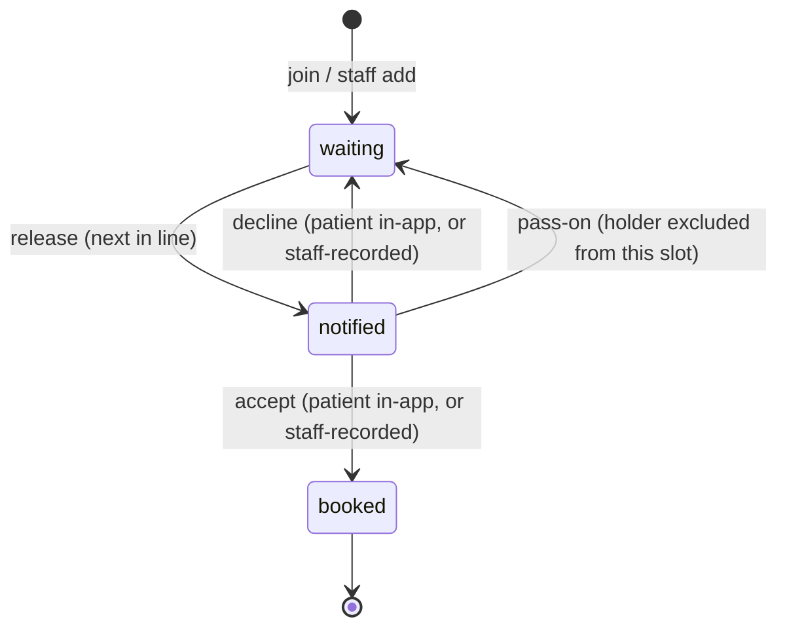
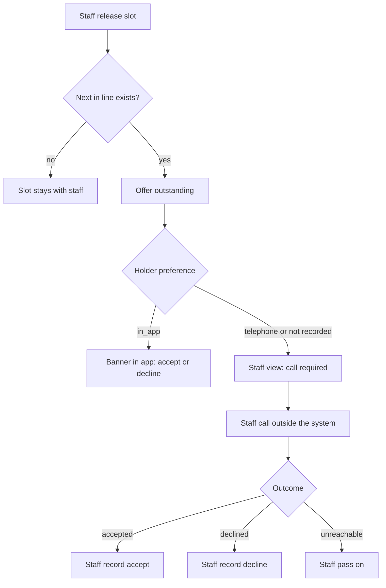

# Design

## Context

The MVP from `waitlist-visibility-notification` is built: Express API with Knex and SQLite, a React web app, and shared response types. Observed in the code:

- `patients` has only `id` and `full_name`; there is no contact preference.
- `offerService` in `apps/api/src/services/offers.ts` handles release, accept, decline and pass-on. Accept and decline require role `patient`; a patient can act only on their own offer (403 otherwise).
- `nextEligibleEntry` picks the first `waiting` entry that has not declined the slot. After a pass-on it searches only entries *behind* the holder, and nothing records that the holder was passed over, so a later release of the same slot can offer it to them again.
- `release` creates a new slot from the date and time staff enter, or reuses the one `open` slot. Nothing stops a new slot with the same date and time as a `booked` one.
- `slots.status` already moves to `booked` on accept, and `resolveIfOutstanding` already makes the first action on an offer win (409 `offer_not_available`).
- Staff view (`waitlistView.ts`) shows name, status, position and join date, plus the outstanding offer and holder, but not a preference, a call flag, or how long the offer has been open.
- Patient view returns the banner for any holder of the outstanding offer, and the web app shows the position as "#N", a Leave button, and for staff a Joined column and a Remove button. Prototype V3 shows none of those.
- The staff add panel is a picker of registered patients who are not yet waiting. The demo seed is Dermatology with five patients and no waiting entries.

See proposal.md for motivation, scope and the decisions taken by assumption.

## Goals / Non-Goals

**Goals:**
- Add a read-only contact preference and let it decide the response channel.
- Let staff record a telephone patient's accept or decline with the same effect, and audit it as staff-entered.
- Make targeting follow "next in line" including the passed-over exclusion, and refuse to release a booked slot.
- Keep the change to the existing layers: no new service, table or dependency beyond one column.

**Non-Goals:**
- Capturing or editing the preference, or any registration screen.
- Any automation of the call, SMS, email or voice (the call is outside the system).
- Real calendar write-back (the slot table is the mocked calendar).
- Changing removal, leaving or position display, and the deferred Slot Claim behaviour.

## Decisions

**Preference is a nullable column on `patients`, with a CHECK for `in_app | telephone`.** Null means not recorded, and the service layer maps null to telephone in one place (`responseChannelOf(patient)` returning `in_app | staff`). Alternative: a separate `contact_preferences` table; rejected because it is one value per patient that this feature only reads. Alternative: store `telephone` for unknown patients; rejected because staff must see "not recorded" distinctly (US-004).

**One response channel per patient, decided by the preference.** `in_app` patients accept and decline through the existing routes; all others are refused there (403 `response_by_staff`) and staff record the outcome through two new staff-only routes, `POST /offers/:offerId/record-accept` and `/record-decline`, which refuse `in_app` patients (409 `patient_responds_in_app`). Alternative: allow both channels and rely on the first-action-wins rule; rejected because it hides the intended channel, creates avoidable races, and contradicts US-008 AC7 and US-011 AC4.

**Share the accept and decline logic between patient and staff.** The existing `accept` and `decline` bodies become internal functions that take the loaded offer, the entry and an `actor` plus a `recordedByStaff` flag. The patient routes call them after the holder check; the staff routes call them after the preference check. This keeps the transaction, conditional update and slot status changes in one place, so a recorded response has the same effect as the patient's (BR-010). Alternative: duplicate the code for staff; rejected as two places to keep consistent.

**Audit distinguishes staff-entered responses by action name.** New actions `offer_accepted_by_staff` and `offer_declined_by_staff`, written with the staff member as actor and the patient's entry. The audit table already has `actor_type`, `actor_id` and `entry_id`, so no schema change. Alternative: add an `on_behalf_of` column; rejected as unnecessary for the MVP.

**Targeting excludes both declined and passed-over patients.** The offers repository gains `excludedPatientIds(slotId)` returning patients with a `declined` or `passed_on` offer for the slot; `nextEligibleEntry` uses it and no longer needs the `behind` argument, because the holder is excluded by their own `passed_on` offer. The passed-on offer row is written before the next search. Alternative: keep the `behind` slice; rejected because it does not stop the holder being re-offered on a later release.

**A booked slot is refused by date and time.** `release` normalises `startsAt` to an ISO instant and rejects with 409 `slot_already_booked` when a `booked` slot has the same `starts_at`. Alternative: a unique index on `starts_at` for booked slots; kept as a defence in the migration (partial unique index where `status = 'booked'`) so a race cannot book the same time twice. Single specialist, so date and time are the slot identity.

**Views carry the new fields; the shared types are the contract.** `StaffEntryView.contactPreference` (`in_app | telephone | null`), `StaffWaitlistResponse.offer.requiresCall` and `.createdAt`, `MyEntryView.responseChannel` and `.holdsOffer`. The patient banner (`offer`) is returned only for `in_app` holders; other holders get `offer: null`, `holdsOffer: true`. The time outstanding is computed in the web app from `createdAt` so the server stays clock-free.

**Hide, do not delete, the deferred screens.** Position "#N", the patient Leave button, the staff Remove button and the Joined column are removed from the screens only. The endpoints, services, shared types (including `position` in the patient view response) and their API tests stay, so the successor spec can switch them back on. Alternative: delete them end to end; rejected because the Product Owner chose to keep the API, and the deferred specs are already planned. Alternative: leave the screens as built; rejected because prototype V3 and PS v2.4 both defer them. Unused web components and tests for the hidden screens are replaced by tests that the controls are absent.

**Staff recording is one click, as in prototype V3.** "They accepted" and "They declined" act immediately, and "Couldn't reach them — pass to next" is the pass-on. Alternative: reuse the patient's confirm modal for staff; rejected as not in the prototype or the PS, though an accidental booking cannot be undone (see Risks).

**Add-panel messages come from API error codes and the `created` flag.** `patient_not_found` (404) maps to "<name> is not registered in hospital records. They must register before joining the waitlist.", and a join response with `created: false` shows "<name> is already on the waitlist." The picker stays limited to registered patients because the hospital lookup is out of scope, so the unregistered case is reachable through the API and tested there, not by choosing an unregistered name in the UI.

**Demo seed follows the V3 walkthrough.** `seedDatabase` sets the specialist clinic to Cardiology and seeds: Maria Gómez (`in_app`, id 1), Ben Carter (`in_app`, id 2), Chloe Nguyen (`in_app`, id 3), Carlos Mendoza (`telephone`, id 4), Ana Torres (not recorded, id 5) and Jorge Ramírez (`telephone`, id 6). A separate `seedDemoWaitlist` puts Carlos and then Ana on the waitlist, and only the seed CLI calls it, so tests start from an empty waitlist. Sofía Reyes is deliberately not seeded. Alternative: put the waiting entries in `seedDatabase`; rejected because many tests expect an empty waitlist.

**Existing behaviour that already satisfies v2.4 is left alone and covered by regression tests:** unknown patient on staff add (404, nothing created), holder-only access (403), first action wins (409), slot marked `booked` on accept, and the 10-second polling that meets the 60-second visibility target.

**UI, based on `docs/waitlist-prototypeV3.html`.** Screens covered by the prototype: patient login, not-joined, waiting, notified (banner, slot card, accept and decline, confirm modal) and booked, with the four-step stepper; staff add panel, slot control and table. Not covered by the prototype and built in its style: the time an offer has been outstanding (US-004), the error states, the telephone patient's own view (the prototype has no patient view for Carlos or Ana), and polling. Differences where the PS wins: the prototype lists `booked` entries in the staff table (PS: excluded), uses a fixed slot time instead of staff entering one, and has "(you)" and "Reset demo" (not built). The journey map's note that a patient joining an empty waitlist is notified immediately is deferred in PS v2.4 Section 10 and is not built.
- Staff table columns are #, Patient, Contact preference (pill: In-app, Telephone, Not recorded) and Status (pill plus a "Requires a call" flag on the holder). The slot control reads "Waiting on <name>'s response — requires a call" and shows the time outstanding; telephone and not-recorded holders get "They accepted", "They declined" and "Couldn't reach them — pass to next", in-app holders only the last. With no eligible patient it reads "No eligible patient remains for this slot."
- Patient view shows the stepper (Joined, Waiting, Notified, Booked), the join date, "We'll notify you here the moment a slot opens. No need to call to check in." while waiting, and for a booked patient the slot and "Contact the office" to change it. The banner appears only when `offer` is present and carries "Staff can pass it to the next patient" if unanswered. When `holdsOffer` is true and there is no banner, a neutral notice says the team will contact them; its wording is pending UX.
- Accept goes through the existing confirm modal for in-app patients; no new step is added.

## Risks / Trade-offs

- [Existing tests and seeds create patients without a preference, which now means telephone] → Update test helpers and seed to set `in_app` explicitly, and add telephone and not-recorded patients for the new paths.
- [Refusing in-app response for non-in-app patients is this plan's reading of US-008 AC7, not a Product Owner decision] → Recorded in the proposal as an assumption; the rule is isolated in `responseChannelOf` and the two route guards, so allowing both channels later is a small change.
- [BR-001, BR-005, BR-012 and the BR-013 wording are *Proposed* in PS-001 v2.4] → Built as written and listed in the proposal; each is a single code path.
- [The 3G load-time and three-step targets cannot be proven by unit tests] → Verified manually with a throttled browser profile; the 99% within 60 seconds target and WCAG 2.1 AA are not tested because the PS still marks them *Proposed*.
- [Two changes describe overlapping behaviour while `openspec/specs/` is empty] → New capability names avoid collisions; reconcile at archive.
- [One-click staff recording cannot be undone, so a mis-click books or releases a slot] → Follows the prototype; the audit record names the staff member, and a confirm step is a small change in `StaffView` if the Product Owner asks for one.
- [Hidden screens leave dead code in the web app] → Remove the unused components and keep the API; the successor spec re-adds them.
- [Prototype V3 and the journey map disagree with the PS on `booked` rows and immediate notification on an empty waitlist] → The PS wins, as the project context already states; the differences are listed above.
- [Date and time as slot identity breaks if a second specialist is added] → Acceptable for the single-specialist scope; revisit with multi-specialty.

## Migration Plan

Add migration `003_contact_preference` (nullable column, CHECK, partial unique index on booked slot times). Existing demo databases keep all patients as "not recorded" until the seed is re-run, so re-run `npm run seed` after migrating. Rollback drops the column and index; no data other than the preference is lost.

## Open Questions

- Exact wording of the patient notice for telephone or not-recorded holders, and the staff button labels, pending UX.
